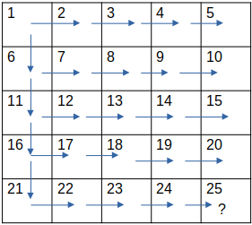

# Labirinto: Busca em profundidade (DFS) e Largura (BFS)
 Trabalho da disciplina de Algoritmos e Estruturas de Dados I.
 
 Integrantes: Anielly Gonçalves e Emanuel Vieira Tavares.

## O problema

Encontrar uma posição em um labirinto utilizando as estratégias de busca randomica, busca em largura(bfs) e busca em profundidade(dfs) de acordo com as seguintes regras:

- A matriz será lida de um arquivo input.data no diretorio dataset do projeto.

- Há uma única matriz de tamanho NxN (considerar testes em matrizes grandes).

- A matriz do labirinto é apresenta os seguintes elementos:

    - Caminho livre (1): Quando a posição estiver preenchida pelo número um (1), a passagem será livre.

    - Dano ( * ): Se a posição possuir um carácter asterisco (*) representará um dano. E ele faz com que o caminhamento volte para a posição inicial (0,0) e a posição acessada que    tinha um dano * vire passagem livre (1).

    - Parede (#): Caso seja uma parede (#) não há como caminhar por ela. Por ser um obstáculo, deverá contorná-la.

    - Ponto de chegada (?): é o objetivo de cada algoritmo, quando sua posição for encontrada a busca se encerra.

Dessa forma, analisando os três métodos de busca, deve-se apresentar uma análise de custo e tempo de execução de cada um, a fim de comparar cada algoritmo.

# Visão Geral

A proposta consiste na utilização de três métodos de busca para encontrar a posição que possui o elemento (?) dentro de uma matriz NxN e analisar o tempo de execução e número de iterações que cada algoritmo apresenta ao fim da execução.

Os três métodos de busca utilizados são:

- Busca Randômica: A partir da posição inicial, novas posições são geradas aleatoriamente para caminhar entre as posições da matriz.
- Busca em largura (bfs): A partir da posição inicial, as posições vizinhas são analisadas e, caso sejam posições válidas, são adicionadas a uma estrutura de dados fila que controla o caminhamento na matriz.
- Busca em profundidade (dfs): A partir da posição inicial, as posições vizinhas são analisadas e, caso sejam posições válidas, são adicionadas a uma pilha que controla o caminhamento na matriz.

Para esse algoritmo a posição inicial adotada é sempre a posição (0,0).

# Entrada

A entrada consiste de um arquivo "input.data" que se encontra no diretório "dataset" do projeto. O arquivo foi gerado a partir de um apicativo gerador disponibilizado pelo professor. O arquivo apresenta em sua primeira linha as informações da dimensão da matriz: número de linhas e número de colunas da matriz. Exemplo de entrada:

Obs.: A matriz de exemplo possui dimensões inferiores para simplificar a exemplificação da entrada. Porém o intuido é executar o algoritmo em matrizes de ordem 50 ou superior.

A matriz é alocada, lida ao inicio da execução de cada algoritmo e sua memória é liberada ao fim da execução.

Além da matriz de entrada que deve ser inserida no diretório do projeto, o usuário deve informar, ao início da execução, se deseja visualizar a busca imprimindo as matrizes no terminal ou se deseja apenas visualizar as informações de comparação de eficiência entre os três algoritmos abordados, atraves de um menu.

# Estratégias de Implementação
A implentação da solução foi feita em c++ somente para a utilização da biblioteca fstream para leitura de arquivos eescrita de arquivos.Por isso, o código não segue todos os padrões de orientação a objetos. Os algoritmos apresentam várias funções auxiliares de execução, mas o "cérebro" se encontra nas funções "start" que lidam com toda a execução.
Como trata-se de um projeto envolvendo 3 algoritmos distintos, a implementação foi dividida em  funções "start" diferentes que iniciam a execução de cada um deles.

As estratégias de movimentação na matriz e de implementação de cada um dos métodos de busca será detalhada a seguir:

## Busca Randômica
### Caminhamento dentro da matriz
As decisões de movimentação são baseadas na posição corrente da matriz, pois as possibilidades de movimento vão depender se a iteração atual se encontra em algum vértice, nas laterais(primeiras e ultimas linhas e colunas) ou no centro do labirinto.
Essa posição relativa foi subdividida em 9 casos. São eles:

1. Vertice superior esquerdo: movimenta para a direita ou para baixo.

2. Vertice superior direito: Movimenta para esquerda ou para baixo

3. Vertice inferior esquerdo: Movimenta para direita ou para cima.

4. Vertice inferior direito: Movimenta para esquerda ou para cima.

5. Primeira Linha: Movimenta para esquerda, para direita ou para baixo.

6. Primeira Coluna: Movimenta para cima, para baixo ou bara direita.

7. Ultima linha: Movimenta para direita, para a esquerda ou para cima.

8. Ultima coluna: Movimenta para cima, para baixo ou para a esquerda.

9. Meio da matriz: Movimenta em todas as direções (esquerda, cima, direito, baixo).

 Os casos estão representados a seguir
 
 

 
 Para cada caso, valores são gerados aleatoriamente por uma função geradora que indica ao algoritmo qual sera o próximo movimento na matriz, dentre os movimentos possíveis.
 
### Critério de parada:
 No algoritmo randômico, o único critério de parada estabelecido é encontrar o caractere (?) que finaliza a execução.
 
### Ciclo de execução/implementação
 A execução é feita dentro de um laço while com o seguinte ciclo de execução:
 
 
* Verifica se atende ao critério de parada;
  * Caso atenda, sai do loop.
* Verifica a posição atual da matriz para executar alguma ação: 
  * Item de dano ( * ): reinicia matriz para posição (0,0);
* Gera um novo movimento aletoriamente com uma função;
      * Verificar se é parede, caso seja, entra em um ciclo até gerar um caminho possível;

## Busca em Largura (BFS) e Busca em Profundidade (DFS)
Os algoritmos de busca BFS e DFS apresentam carcaterísticas de implementação muito parecidas. A maior diferença entre os dois é a estrutura de dados auxiliar utilizada: fila ou pilha. Cada estrutura da características diferentes de movimentação quando visualizamos a execução do algoritmo, além de apresentarem número de iterações e tempo de execuções distintos por tomarem decisões diferentes de movimentação ao longo da execução da busca.

O DFS é implementado utilizando a estrutura de dados pilha, que da uma carterística de "reta" na propagação do movimento.

O BFS, por sua vez, é implementado com a utilização da estrutura de dados fila, que da uma carcaterística de propagação de onda nos movimentos. 

### Análise de Posições Válidas
Tanto o BFS quanto o DFS usam uma função que recebe a coordenada (x,y) da posição analisada e retorna se a posição é válida ou não. Essa função é importante para a estratégia de movimentação adotada para ambos os algoritmos.

As direções de movimentação são: cima, esquerda, baixo, direita.

### Gerar Novos Movimentos
Para gerar novos movimentos, posições precisam ser inseridas na fila e na pilha para serem executados nas próximas iterações. Para isso, a posição corrente tem seus vizinhos verificados pela função "isValidPosition" e verifica-se também se são posições diferentes do elemento de parede (#) que precisa ser desviado. Caso a posição seja válida e diferente de parede, ela é inserida na estrutura de dados. 

As posições são verificadas com um laço for que percorre as 4 possíveis direções que são representadas por 2 vetores de direção: dr para movimentar em linhas e dc para movimentar em colunas.

A posição corrente é somada com a posição dos vetores dr e dc para obter-se uma nova posição a ser validada e inserida na estrutura:

Dessa forma, para essa sequencia de movimentos dos vetores dr e dc as posições da matriz a serem analisadas são:
- Para i = 0: posição de cima 
- Para i = 1: posição de baixo 
- Para i = 2: posição da esquerda 
- Para i = 3: posição da direita

## Critérios de parada
Os critérios de parada para o BFS e para o DFS são:
- Encontrar a posição do ponto de chegada (?).
- A estrutura de dados ficar vazia (fila para o BFS e pilha para o DFS).

## Ciclo de execução BFS:
Fora do loop de execução, ao iniciar o algoritmo, a posição inicial (0,0) é inserida na fila. 
Após isso, o algoritmo entra em um loop while que executa até encontrar um dos critérios de parada.
- Loop:
  - Incrementa o número de iterações;
  - Atribui o primeiro elemento da fila para a posição corrente;
  - Desenfileira, removendo o primeiro elemento;
  - Verifica se a posição corresponde ao ponto de chegada (?)
   - Caso atenda, o algoritmo é encerrado e é apresentado as informações na saída.
  - Verifica se a posição corrente corresponde a elemento de dano;
   - Caso seja:
     - Limpa a fila;
     - Enfileira novamente, inserindo a primeira posição (0,0) da matriz ma fila;
     - Muda a posição de ( * ) para ( 1 ), tornando a caminho livre;
     - Continua para a próxima iteração;
  - Verifica os vizinhos da posição corrente se são válidos e diferentes de parede (#). 
  - Os vizinhos que forem válidos são inseridos na fila com a ordem de prioridade de verificação: cima, baixo, direita, esquerda.
  - Caso o usuário tenha selecionado a opção de impressão das matrizes, imprime a matriz no estado corrente.

#### Exemplo:
Comportamento do algoritmo BFS em uma matriz 5x5 com caminho livre:

Ordem da fila: 1, 6, 2, 11, 7, 3, 16, 12, 8, 4, 21, 17, 13, 9, 5, 22, 18, 14, 10, 23, 19, 15, 24, 20, 25.

## Ciclo de execução DFS:
Fora do loop de execução, ao iniciar o algoritmo, a posição inicial (0,0) é inserida na pilha. 
Após isso, o algoritmo entra em um loop while que executa até encontrar um dos critérios de parada.
- Loop:
  - Incrementa o número de iterações;
  - Atribui o topo da pilha para a posição corrente;
  - Desempilha, removendo o topo da iterção corrente;
  - Verifica se a posição corresponde ao ponto de chegada (?)
   - Caso atenda, o algoritmo é encerrado e é apresentado as informações na saída.
  - Verifica se a posição corrente corresponde a elemento de dano ( * );
   - Caso seja:
     - Limpa a pilha;
     - Insere a primeira posição (0,0) da matriz na pilha;
     - Muda a posição de ( * ) para ( 1 ), tornando a caminho livre;
     - Continua para a próxima iteração;
  - Verifica os vizinhos da posição corrente se são válidos e diferentes de parede (#). 
  - Os vizinhos que forem válidos são inseridos na pilha com a ordem de prioridade de verificação: esquerda, cima, direita, baixo.
  - Caso o usuário tenha selecionado a opção de impressão das matrizes, imprime a matriz no estado corrente.

#### Exemplo:
Comportamento do algoritmo DFS em uma matriz 5x5 com caminho livre:

O caminho que o algoritmo de fato percorre é o caminho colorido. Porém é possível observar que as setas apontam para possíveis posições vizinhas que também são adicionadas na pilha. Entretanto, como a pilha remove o ultimo elemento, e o algoritmo torna o topo da pilha na posição corrente, a matriz recebe esse formato de caminhamento profundo em linha reta.

Ordem da pilha: 1*, 2, 6*, 7, 11*, 12, 16*, 17, 21*, 22*, 23*, 18, 24*, 19, 25*.

As posições marcadas com * foram as posições desempilhadas, que nesse caso, para uma matriz com caminhos livres, coincide com o caminho até a condição de parada.

Obs.: A matriz sem elemetos de dano ( * ) e sem elementos de parede (#) estão presentes apenas para exemplificar como os algoritmos BFS E DFS executam de acordo com a estrutura de dados que cada um utiliza.

# Saída
A saída da execução é apresentada de duas maneiras: um arquivo output.data no diretório dataset e impressão no terminal.

## Arquivo Output:
O arquivo de saída gerado apresenta o estado da matriz em consequência da execução de cada um dos algoritmos de busca, a posição encontrada e o número de iterações.
### Exemplo de saída para uma matriz de entrada simples:
#### Entrada

#### Arquivo de Saída

## Saída do terminal:
A saída do terminal depende da escolha do usuário no início da execução do algoritmo.

### Visualizando as Matrizes
A cada iteração de cada algoritmo, a matriz no estado corrente é impressa no terminal e, em seguida, a função system("clear") limpa a tela com um delay estabelecido para cada algoritmo de forma que favoreça a visualização da busca.

Ao fim da execução das buscas, as informações de tempo de execução e número de iterações são informadas. É importante ressaltar que devido ao atraso de impressão, o tempo apresentado é muito maior, mas o número de iterações é coerente.

### Somente Tempo de Execução
Somente o resultado da execução é impresso no terminal.

# Tempo de execução
O tempo de execução é calculado utilizando a biblioteca chrono e é medido em microssegundos. O contador é iniciado antes do início da execução de um algoritmo na chamada da função start e finaliza após a execução da busca.  

# Testes e comparação de execução
Para analisar o comportamento dos algoritmos de busca em diferentes matrizes, cada matriz testada foi executada 10 vezes. Em cada teste, valores distintos de tempo de execução foram gerados. 
Para comparar o valor de tempo de execução de cada um dos algoritmos, foi calculada a média aritmética simples dos tempos de execução apresentados em 10 execuções junto do desvio padrão da média.
O desvio padrão irá indicar a dispersão dos dados.

## Teste 1
Matriz 50x50 com itens # e * formando o labirinto, com o ponto de chegada na ultima posição.

### Número de iterações

Iterações BFS: 4088

Iterações DFS: 261

Iterações RND: 192490,231456,197562,195160,208768,184104,227414,191184,182898,312822 

### Tempos de execução (em microssegundos)
RND: 1505586, 17532928,14409801,15174466,16635947,14491748,17462575,14651139,14045105,24636014. 

BFS: 1836,1482,1793,1310,1696,1991,1514,1366,1292,1685. 

DFS: 802,571,787,742,750,804,550,603,774,607.

### Média

RND: 15054531 microssegundos.

BFS: 1597 microssegundos.

DFS: 699 microssegundos.

### Desvio Padrão:

DP RND: 5693556 microssegundos.

DP BFS: 240 microssegundos.

DP DFS: 103 microssegundos.
###

Para esse caso de teste o algoritmo de busca em profundidade (dfs) se mostrou mais eficiente.

## Teste 2
Matriz 50x50 com itens # e * formando o labirinto, com o ponto de chegada no centro da matriz.

### Número de iterações

Iterações BFS: 159613

Iterações DFS: 170542

Iterações RND (em média): 305242

### Tempos de execução (em microssegundos)

RND:  24937388,13723787,16328157,25950108,20894583,20194111,21518451,24933455,17318563,17865103

BFS:  18924,20892,21251,24831,19115,19261,21882,22345,22688,28846

DFS:  26855, 25081,25023,25517,25585,24822,28099,25657,24463,39600

### Média

RND: 20366371 microssegundos

BFS: 22004 microssegundos

DFS: 27070 microssegundos

### Desvio Padrão:
RND: 4089867 microssegundos

BFS: 3029 microssegundos

DFS: 4530 microssegundos

###
Para esse caso de teste o algoritmo de busca em largura (bfs) se mostrou mais eficiente.

## Teste 3
Matriz 50x50 somente com caminho livre (1) e o ponto de chegada na ultima posição.

### Número de iterações

Iterações BFS: 1394

Iterações DFS: 99

Iterações RND: 16336,1890,1960,2512,5642,3226,7978,11458,3594,1794

### Tempos de execução (em microssegundos)

RND: 843548,68472,107912,79646,181885,102538,264101,714149,119133,67803

BFS: 1895,1168,1006,1782,954,697,863,1909,2009,1525

DFS: 910,702,708,951,745,671,621,1019,1739,861

### Média

RND: 254919 microssegundos.

BFS: 1381 microssegundos.

DFS: 893 microssegundos.

### Desvio Padrão:

DP RND: 284128 microssegundos.

DP BFS: 497 microssegundos.

DP DFS: 325 microssegundos.
###

Para esse caso de teste o algoritmo de busca em profundidade (dfs) se mostrou mais eficiente.

## Teste 4

Matriz 50x50 somente com caminho livre (1) e o ponto de chegada no centro da matriz.

### Número de iterações

Iterações BFS: 1058,

Iterações DFS: 1446

Iterações RND: 9673,2309,13675,3035,759,7715,6183,5625,1957

### Tempo de execução (em microssegundos)

Tempo de execução RND: 513305,110429,600608,110236,26368,258303,205205,177177,1957,151866

Tempo de execução BFS: 1818,1161,1272,1190,1211,1620,914,1004,1124,707

Tempo de execução DFS: 1715,2321,1292,1060,1109,2225,1045,1147,1138,1159 

### Média

Media RND: 215545.4 microssegundos

Media BFS: 1202.1 microssegundos

Media DFS: 1421.1 microssegundos

### Desvio Padrão

DP RND: 196622.5776 microssegundos

DP BFS: 322.18747 microssegundos

DP DFS: 489.02884 microssegundos

###

Para esse caso de teste o algoritmo de busca em largura (bfs) se mostrou mais eficiente.

##

A partir da análise dos teste apresentados, nota-se que o desvio padrão dos algoritmos dfs e bfs é um valor relativamente baixo, o que indica que há pouca disperção de dados. O aloritmo randômico, entretanto, apresenta uma disperção maior do tempo de execução devido à variação imprevísivel a cada nova execução.

# Conclusão

Portanto, de acordo com os critérios de implementação e análise de execução apresentados, foi possível verificar que os algoritmos de busca abordados apresentam comportamentos distintos.

O algoritmo randômico pode apresentar raros casos de resultados positivos, com baixo tempo de execução, mas haverá  casos (maioria) em que seu tempo de execução será enorme, devido a sua carcterística de movimentar-se aleatoriamente. Para o algoritmo randomico, observa-se que seu número de iterações é, por padrão da análise de testes, mais alto que dos demais algoritmos.

Os algoritmos dfs e bfs, por sua vez, apresentaram tempos de execução e números de iterações bem menores. Devido às semelhanças de implementação, os dois algoritmos apresentam comportamentos parecidos em relação ao número de iterações e tempo de execução para determinados casos de teste. Entretanto, para determinar qual algoritmo vai ser mais eficiente, vai depender da posição que o elemento de critério de parada (?) estará localizado no labirinto. Devido às carcaterísticas e regras de implementação adotadas (estrutura de dados e ordem de movimentação), para os testes analisados, a busca em profundiade se mostrou mais eficiente para casos em que o caractere (?) estava mais próximo às laterais da matriz. Já a busca em largura mostrou-se eficiente para casos em que o caractere (?) se encontrava próximo ao centro do labirinto. Dessa forma, vale ressaltar que, para definir qual algoritmo apresenta melhor desempenho, irá depender da configuração da matriz ou da sorte de boas escolhas de movimentção para a busca randômica.
Por isso a resposta para qual caso é melhor é: depende.

Além disso, é importante notar que a estrutura de dados pilha e fila são resposáveis pelas diferenças de comportamento entre os algoritmos de busca dfs e bfs devido a forma com que há inserções e remoções de elementos em cada uma das estuturas.

Sendo assim, em uma análise geral dos testes realizados, o número de iterações dos algoritmos bfs e dfs são constantes e do algoritmo randomico varia bastante. Contudo, o tempo de execução dos algoritmos que utilizam uma estrutura de dados auxiliar é  menor, principalmente para matrizes de ordens superiores, como foi testado com matrizes 50x50.

# Especificações de Hardware

| Componentes            | Detalhes                                                                                         |
| -----------------------| -----------------------------------------------------------------------------------------------  |
|  `Processador`         | Intel© Core™ i7-4500U CPU @ 1.80GHz × 2                                            |
|  `RAM Instalada`       | 8.0 GB (Utilizável: 7.6 GB)                                                                      |
|  `Tipo de Sistema`     | Sistema Operacional de 64 bits, processador baseado em x64                                       |
|  `Sistema Operacional` | Linux Mint 21.1 Cinnamon                                            |

# Compilação e execução:

| Comando                |  Função                                                                                           |                     
| -----------------------| ------------------------------------------------------------------------------------------------- |
|  `make clean`          | Apaga a última compilação realizada contida na pasta build                                        |
|  `make`                | Executa a compilação do programa utilizando o gcc, e o resultado vai para a pasta build           |
|  `make run`            | Executa o programa da pasta build após a realização da compilação                                 |

# Referências 
SILVA, M. P. da. Algoritmos e Estrutura de Dados I - Aula 2. : Centro Federal de
Educação Tecnológica de Minas Gerais - CEFET-MG, 2023.
